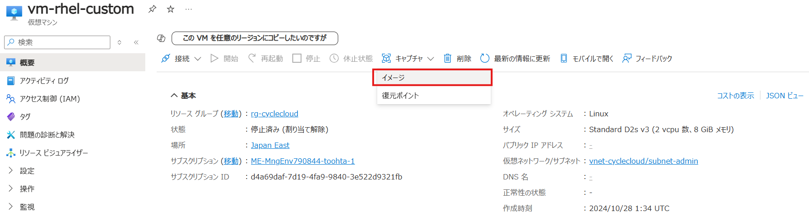
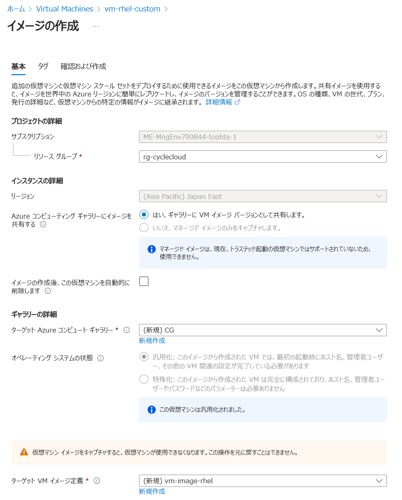
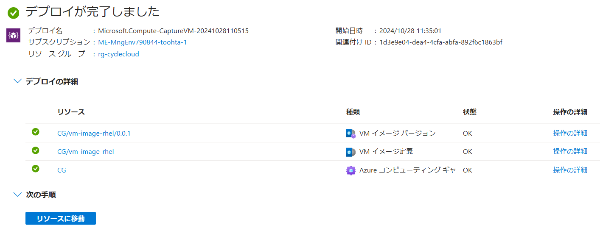
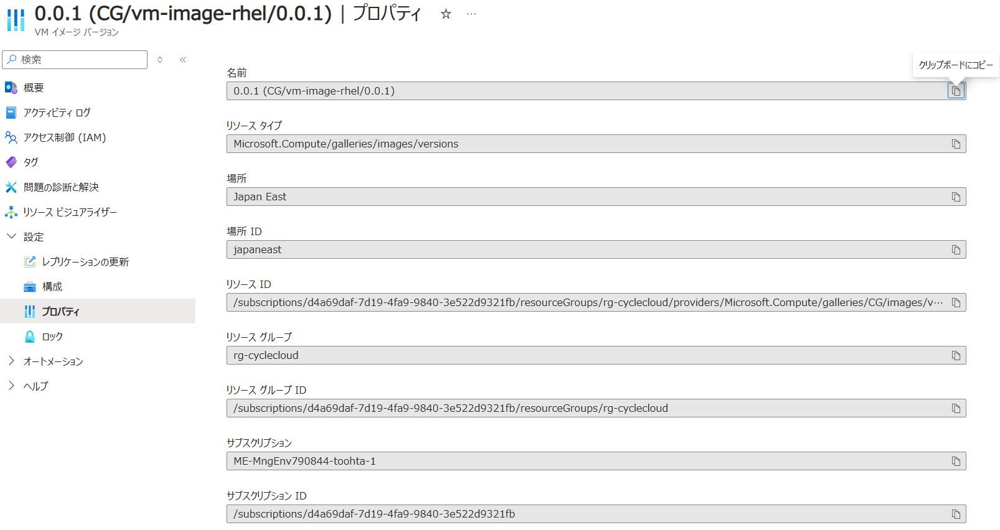
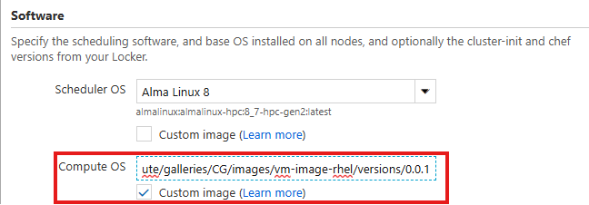

# カスタムイメージの利用

CycleCloud では、クラスターのノードとしてカスタムイメージを利用することができます。予め必要なソフトウェアや設定を施したイメージを作成し、それをノードに利用することで、クラスターのセットアップを効率化することができます。
カスタムイメージの使用には以下が必要です。

1. カスタムイメージの用意
   1. VMを作成、必要なカスタマイズを行い、一般化する
   2. VMをキャプチャし、カスタムイメージを作成
   3. Azure Compute Galleryでイメージをバージョン管理し、必要に応じて更新
2. ノードのイメージとしてカスタムイメージを指定（以下のいずれで指定）
   1. CycleCloudの管理UIからイメージを指定
   2. クラスターテンプレート内に指定

実際の利用方法については、以下の手順を参照してください。

## 1. カスタムイメージの用意

カスタムイメージの作成については以下のドキュメントを参照ください。
- [VMの一般化](https://learn.microsoft.com/ja-jp/azure/virtual-machines/generalize)
- [ポータルで VM のイメージを作成する ](https://learn.microsoft.com/ja-jp/azure/virtual-machines/capture-image-portal)
- [Create an image definition and an image version](https://learn.microsoft.com/ja-jp/azure/virtual-machines/image-version?tabs=portal%2Ccli2) 

### 1.1 VMの一般化

VMをデプロイし、必要なカスタマイズを加えたら、カスタマイズを加えてVM上で以下のコマンドを実行し、VMを一般化します。一般化は、テンプレートとして利用できるようにマシン固有の情報を削除する処理です。

```bash
sudo waagent -deprovision+user
```

実行例：

```bash
[azureuser@vm-rhel-custom ~]$ sudo waagent -deprovision+user
WARNING! The waagent service will be stopped.
WARNING! All SSH host key pairs will be deleted.
WARNING! Cached DHCP leases will be deleted.
WARNING! root password will be disabled. You will not be able to login as root.
WARNING! /etc/resolv.conf will be deleted.
WARNING! azureuser account and entire home directory will be deleted.
Do you want to proceed (y/n)y
2024-10-28T01:48:16.636984Z INFO MainThread Examine /proc/net/route for primary interface
2024-10-28T01:48:16.637954Z INFO MainThread Primary interface is [eth0]
```

VMからログアウトし、以下のコマンドを実行し、VMを停止します。

```bash
az vm deallocate --resource-group myResourceGroup --name myVM
```

VMを一般化します。一般化した段階で起動不可となります。

```bash
az vm generalize --resource-group myResourceGroup --name myVM
```
### 1.2 VMのキャプチャ

VMをキャプチャし、イメージを作成します。PortalのVM管理画面から、VMキャプチャ - イメージ を選択します。



イメージの管理画面に遷移しますので、必要事項を入力します。





### 1.3 イメージのバージョン管理

イメージの管理画面から、バージョンを追加します。ここではリソースIDを確認しておきます。



## 2. イメージの指定

CycleCloudでは、クラスターのノードに利用するイメージを指定することができます。以下のいずれかの方法で指定します。

### 2.1 CycleCloudの管理UIからイメージを指定




### 2.2 クラスターテンプレート内に指定

クラスターテンプレート内で直接指定することも可能です。以下のように指定します。nodeセクションのImageNameにイメージのリソースIDを指定します。

```ini
[[node custom]]

  ImageName = /subscriptions/xxxxxxxx-xxxx-xxxx-xxxxxxxxxxxx/resourceGroups/MyResourceGroup/providers/Microsoft.Compute/images/MyCustomImage
```

## 起動確認

今回はRHEL 8.10のイメージを作成し、それを利用してクラスターを構築しました。クラスターの起動が正常に行われることを確認します。

以下のようにインタラクティブジョブを投入し、起動したノードにログインして、イメージが正しく利用されていることを確認します。

```bash
[cycleadmin@PBSserver ~]$ qsub -I
qsub: waiting for job 6.PBSserver to start
qsub: job 6.PBSserver ready

[cycleadmin@exe-bq5ks000000 ~]$ cat /etc/redhat-release
Red Hat Enterprise Linux release 8.10 (Ootpa)
```

RHELで起動していることが確認できました。
